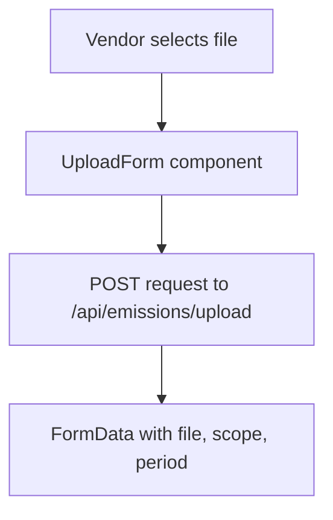
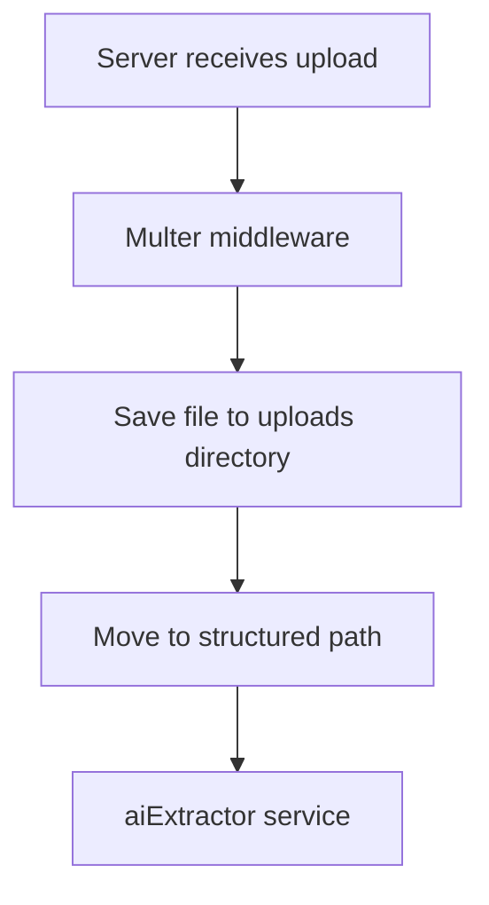
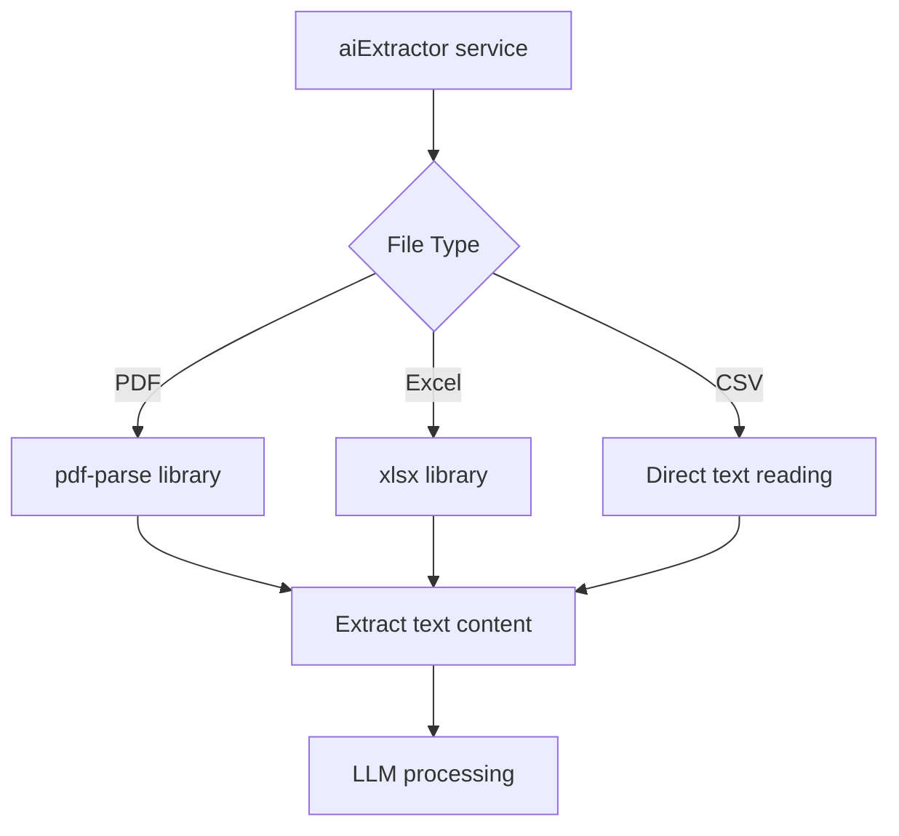
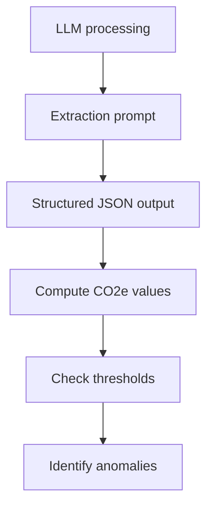
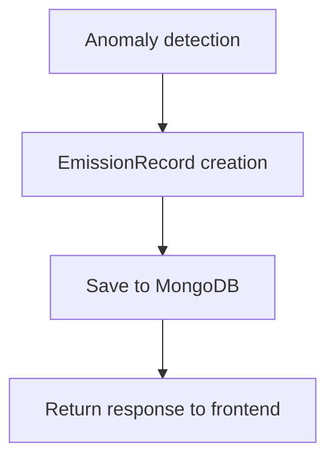
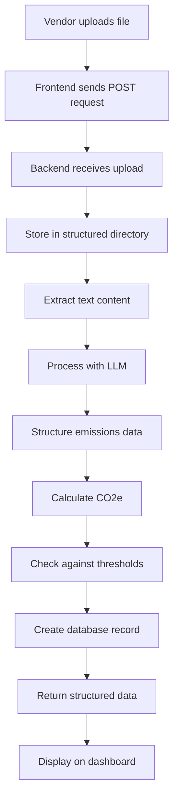

# Vendor Upload Flow

## Step 1: Frontend Upload
When a vendor uploads a file through the UI:



The frontend uses a form with:
- File input (PDF/Excel)
- Scope selection (1, 2, or 3)
- Period selection (e.g., 2025-Q4)

## Step 2: Backend Processing
The server receives the upload and processes it:



### File Storage Structure
```
server/_emissionData/
└── dataCenterName/
    └── period-1764269762118/
        └── section1/
            └── original_filename.pdf
```

## Step 3: AI Extraction
The aiExtractor service processes the file based on MIME type:



## Step 4: Data Processing
The extracted text is processed by an LLM to extract emissions data:



## Step 5: Database Storage
The processed data is saved to the database:



## Complete Flow


## Key Components
- **Multer**: Handles file uploads and storage
- **pdf-parse**: Extracts text from PDF files
- **xlsx**: Parses Excel/Spreadsheet files
- **OpenAI LLM**: Extracts structured emissions data from text
- **EmissionRecord model**: Stores the processed data in MongoDB
