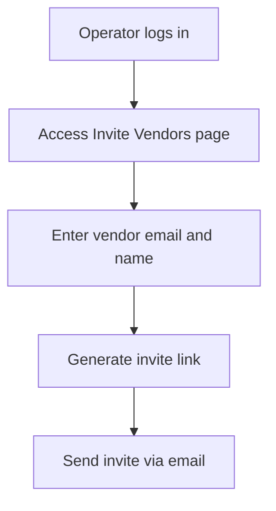
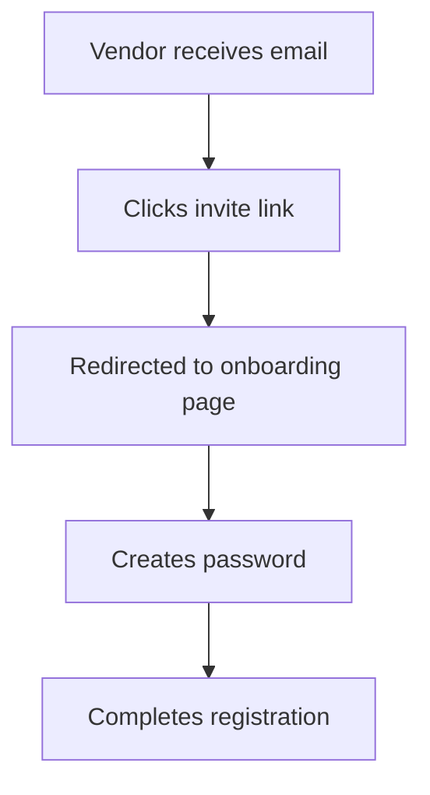
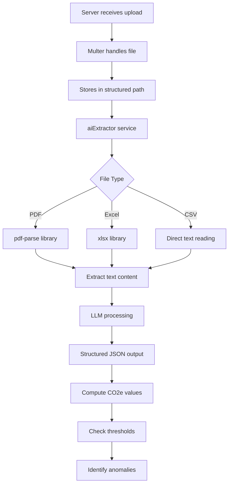
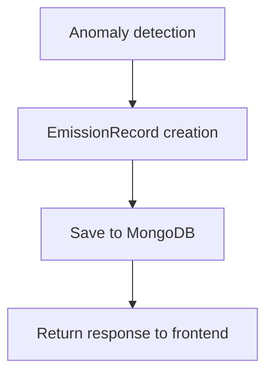
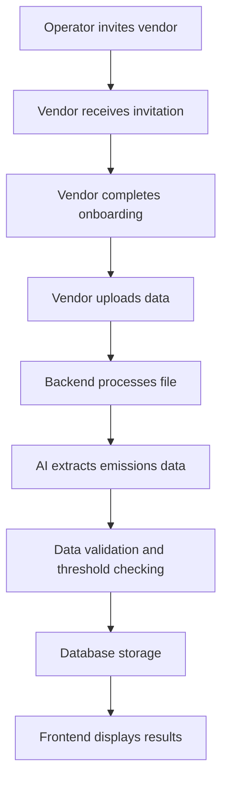

# Vendor Upload Flow - User Story

## Step 1: Operator Invites Vendor
The process begins with an operator inviting a vendor:



**How it works:**
1. The operator navigates to the "Invite Vendors" page
2. Enters the vendor's email address and company name
3. Clicks "Generate invite" to create a unique invitation link
4. Sends the generated link to the vendor via email

The backend generates a random token and stores it in the `VendorInvite` model with the vendor's information.

## Step 2: Vendor Receives Invitation
The vendor receives the invitation and completes onboarding:



**How it works:**
1. The vendor receives an email with the invitation link
2. Clicks the link, which redirects them to `/vendor/onboard/:token`
3. The server verifies the token is valid and pending
4. The vendor creates a password and completes registration
5. The system creates a new user account with role="vendor"
6. The invitation status is updated to "accepted"

## Step 3: Vendor Uploads Data
Once onboarded, the vendor can upload their emissions data:

```mermaid
graph TD
    K[Vendor logs in] --> L[Access Vendor Dashboard]
    L --> M[Clicks Upload button]
    M --> N[Selects file (PDF/Excel)]
    N --> O[Chooses scope and period]
    O --> P[Uploads & AI-parses]
```

**How it works:**
1. The vendor logs in to their account
2. Navigates to the Vendor Dashboard
3. Clicks the "Upload data" button
4. Selects a PDF or Excel file containing emissions data
5. Chooses the appropriate scope (1, 2, or 3) and period
6. Clicks "Upload & AI-parse" to submit the file

## Step 4: Backend Processing
The backend processes the uploaded file:



**How it works:**
1. The server receives the upload via multer middleware
2. Saves the file to a structured directory path based on data center, period, and scope
3. The aiExtractor service processes the file:
   - For PDF: Uses pdf-parse to extract text
   - For Excel: Uses xlsx to parse spreadsheet data
   - For CSV: Reads directly as UTF-8 text
4. The extracted text is processed by an LLM to extract structured emissions data
5. The system computes CO2e values and checks against emission thresholds
6. Any anomalies are identified and recorded

## Step 5: Database Storage
The processed data is saved to the database:



**How it works:**
1. A new EmissionRecord document is created with:
   - Owner type (vendor/operator)
   - Owner ID
   - Scope (1, 2, or 3)
   - Data center name
   - Folder reference
   - Section reference
   - Raw file path
   - Extracted data (structured JSON)
   - AI summary
   - AI anomalies
   - Period
2. The record is saved to MongoDB
3. The frontend receives the structured data, AI summary, and any detected anomalies

## Complete Flow


## Key Components
- **Operator**: Initiates the vendor invitation process
- **Vendor**: Completes onboarding and uploads emissions data
- **Multer**: Handles file uploads and storage
- **pdf-parse**: Extracts text from PDF files
- **xlsx**: Parses Excel/Spreadsheet files
- **OpenAI LLM**: Extracts structured emissions data from text
- **EmissionRecord model**: Stores the processed data in MongoDB
